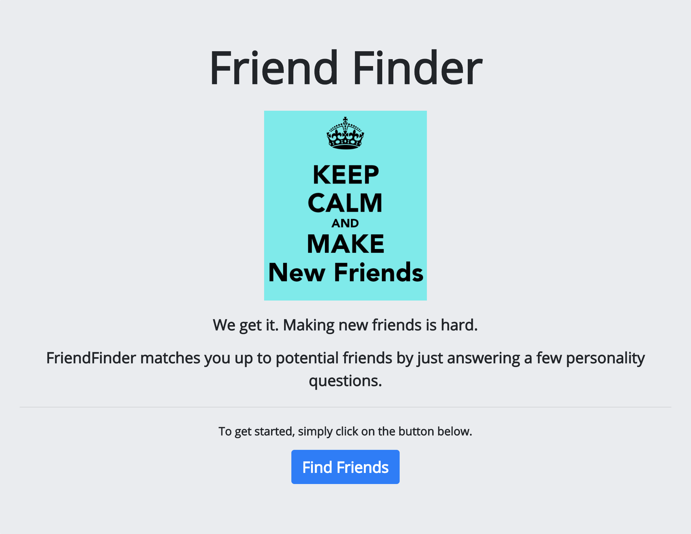

# friendfinder
Link to GitHub repository: https://github.com/peterlgustafson/friendfinder

About: FriendFinder app takes in results from a users' survey and compares their answers with those from other users. The app will then display the name and picture of the user with the best overall match.

The App: 

Description: This is a simple Node.JS powered application that lets a user answer 10 simple personality questions and get matched up with a potential new friend. 

- Once the user submits the survey, their score get cross-referenced against a database of friends and matches them up with their best match. 

Technologies Used: HTML, CSS, Bootstrap, JavaScript/jQuery, Node.JS, Express.
